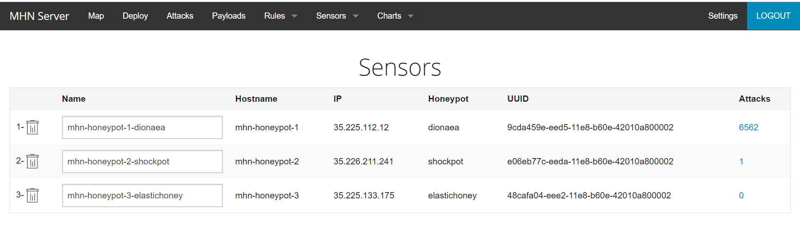
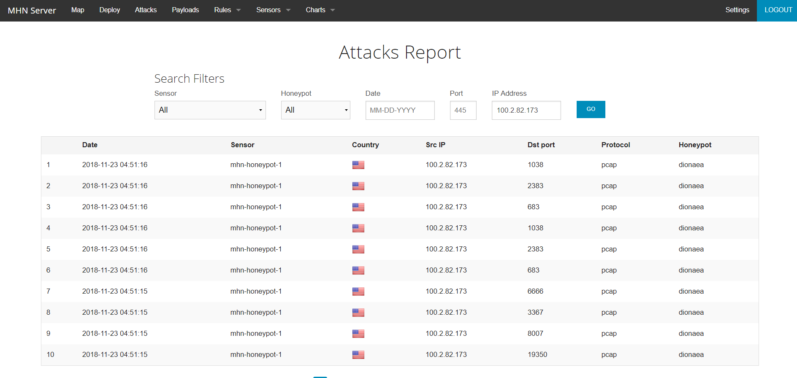

# Week-9-Project-Honeypot

#Honeypots Deployed

#Issues
- When installing MHN, I encountered an error where a shell script `install_hpfeeds.sh` tried to clone a private repository. The fix was to change a value in the script.
- I couldn't export the json file with the Google Cloud SDK Shell. The shell was not able to recognize the command `gcloud compute ssh mhn-admin --command="mongoexport --db mnemosyne --collection session > session.json"` so I had to use a bash terminal to export the file.

#Summary of Data Collected

